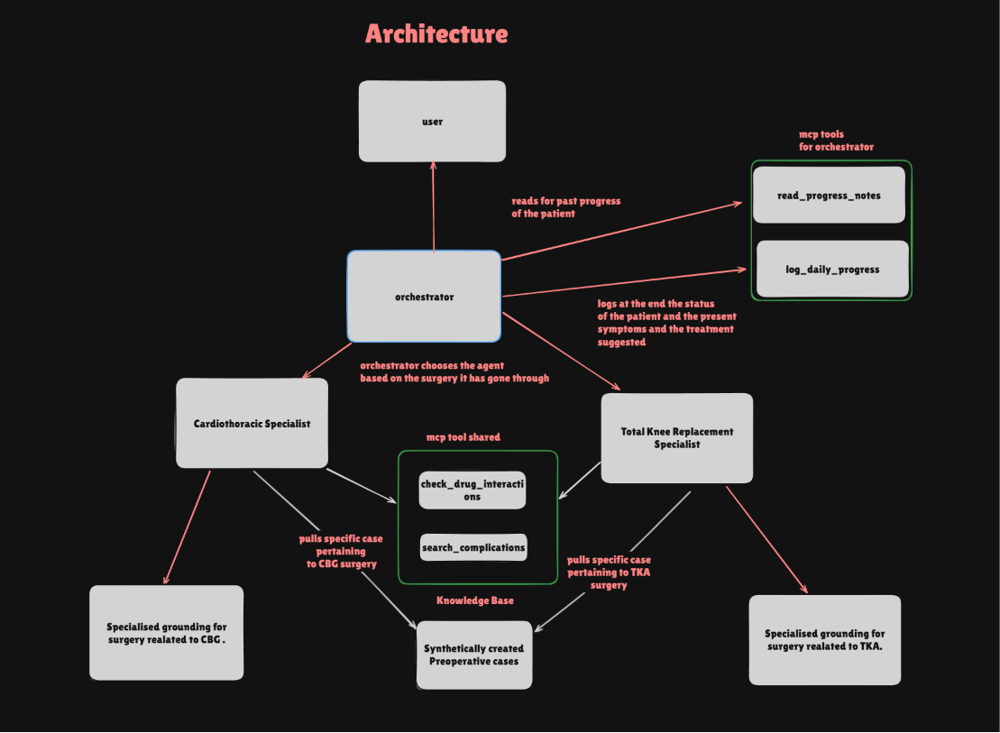

# PostOp Guardian — MCP Showcase
### Autonomous Multi-Agent Post-Operative Monitoring System

PostOp Guardian is an autonomous, multi-agent post-operative monitoring system built to bridge the dangerous gap between hospital discharge and the 4-week follow-up appointment. 

By using a clinical Orchestrator and surgical domain specialists, the system conducts daily patient check-ins, detects early complications (like DVT, pulmonary embolism, or infections), and maintains a longitudinal recovery record grounded in real medical literature and FDA data.


---

## 🎬 Demo Video

[](https://www.youtube.com/watch?v=1ncLKndNuI8)

---


## 🌟 The Problem
Post-operative care is one of the most significant gaps in modern healthcare. Patients are often sent home after major surgery with only a discharge pamphlet. In the subsequent weeks, life-threatening complications can develop silently. PostOp Guardian fills this gap by providing a "digital safety net" that monitors patients daily.

---

## 🚀 Quick Start (Running Independently)

This project uses `uv` for lightning-fast dependency management.

### 1. Prerequisites
- Python 3.12+
- [uv](https://github.com/astral-sh/uv) installed

### 2. Install Dependencies
```bash
uv sync
```

### 3. Run the MCP Servers

You will need two terminals to run both servers simultaneously.

**Terminal 1: Orchestrator MCP (Patient Progress Logger)**
Provides longitudinal memory by reading and writing structured daily logs.
```bash
uv run orchestrator_mcp_server.py
```
*Runs on port 8006.*

**Terminal 2: Clinical Assessor MCP (Medical Grounding)**
Provides real-time grounding via OpenFDA (drug interactions) and PubMed (medical literature).
```bash
uv run shared_mcp_server.py
```
*Runs on port 8005.*

---

## 🏗️ System Architecture



### Agents & Roles
| Agent | Role | Tools Available |
|-------|------|----------------|
| **Orchestrator** | Conversational Lead | `read_progress_notes`, `log_daily_progress`, FHIR Access |
| **TKA Specialist** | Orthopedic Auditor | PubMed, OpenFDA, Clinical KB |
| **CABG Specialist** | Cardiac Auditor | PubMed, OpenFDA, Clinical KB |

---

## 🛡️ Clinical Safety & Grounding

PostOp Guardian is built on clinical standards to ensure safety and accuracy:

- **NEWS2 Triage:** Risk outputs use the **National Early Warning Score 2 (NEWS2)** protocol to triage patients into three actionable categories:
    - **GREEN:** Normal recovery. Symptoms are expected and manageable at home (e.g., mild swelling).
    - **AMBER:** Concerning symptoms matching known complications. Requires prompt clinical advice (e.g., calf pain indicating potential DVT).
    - **RED:** Immediate emergency. Triggered by severe symptoms (e.g., chest pain) **OR** by unknown, out-of-scope symptoms (if the AI finds zero medical evidence linking a symptom to the surgery, it defaults to a systemic emergency and refuses to guess).
- **Evidence Triangulation:** Specialists only reach a diagnosis after triangulating data from three sources:
    1. **PubMed:** Real-time medical literature search.
    2. **OpenFDA:** Pharmacovigilance data for drug-drug interactions.
    3. **Knowledge Base:** Expert-curated surgical case histories.
- **Demographic-Aware Queries:** Queries are dynamically formulated using patient demographics (age, gender, comorbidities) from FHIR records to ensure clinical relevance.
- **Out-of-Scope Override:** If symptoms are unrelated to the surgery (e.g., neurological symptoms after knee surgery), the system triggers an emergency override instead of attempting a diagnosis.

---

## 🛠️ The MCP Servers

### 🏥 Clinical Assessor MCP (`shared_mcp_server.py`)
- `check_drug_interactions`: Queries FDA FAERS database for co-administered meds.
- `search_complications`: Queries PubMed for literature matching symptoms + surgery.
- **Result Caching:** Prevents infinite tool loops by enforcing a decision after a result is returned.

### 📝 Orchestrator MCP (`orchestrator_mcp_server.py`)
- `read_progress_notes`: Recaps history to track trends (e.g., worsening pain over 3 days).
- `log_daily_progress`: Persists structured daily notes.
- **Longitudinal Care:** The system "remembers" a patient's AMBER status from Day 3 and follows up specifically on that status during Day 12.

---

## 📂 File Map
- `orchestrator_mcp_server.py`: Server for memory and persistence.
- `shared_mcp_server.py`: Server for clinical grounding.
- `patient_progress_log.json`: The longitudinal patient data store.
- `PROJECT_MEMORY.md`: Detailed architecture and prompts.
- `dr_smith_case_history.md`: The clinical knowledge base.

## 📄 License
MIT
